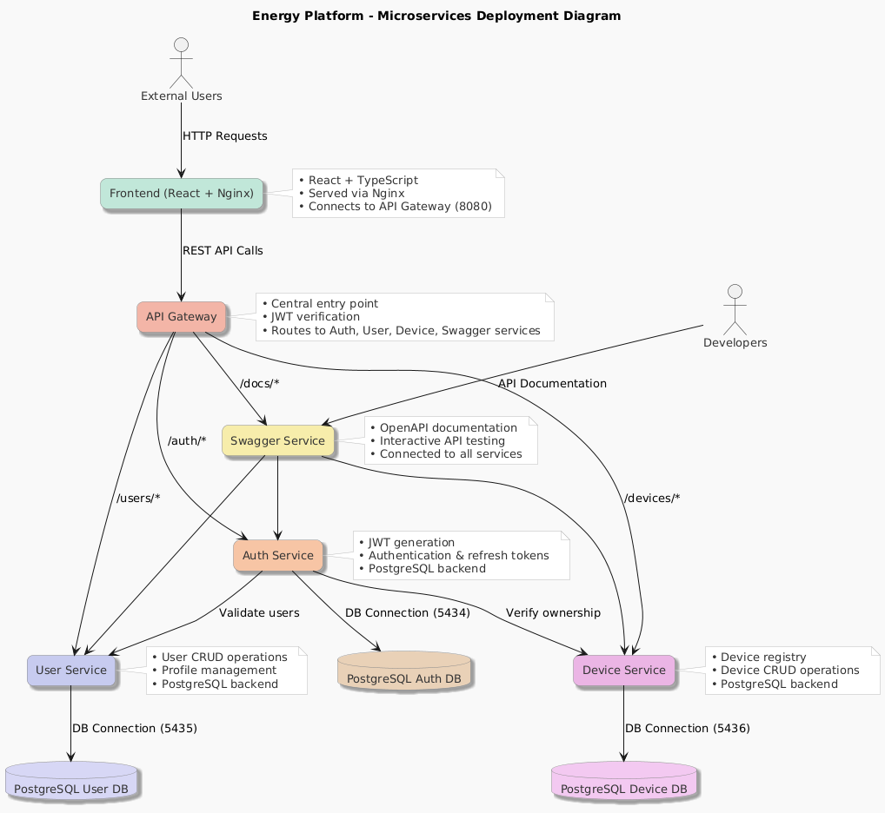

# Energy Management System

A distributed microservices-based Energy Management System that allows authenticated users to access, monitor, and manage smart energy metering devices. Built with containerized microservices architecture using Docker.

## Architecture



The system consists of the following components:

- **Frontend Application**: React + TypeScript + Tailwind CSS web interface
- **API Gateway**: Nginx reverse proxy for request routing, load balancing, and authentication
- **Authentication Service**: Handles user authentication and JWT token management
- **User Management Service**: Manages user profiles and role-based access
- **Device Management Service**: Handles energy device CRUD operations
- **Swagger API Documentation Service**: Provides interactive API documentation
- **PostgreSQL Databases**: Separate PostgreSQL instances for each service (auth, user, device)

## Features

### User Roles

- **Administrator**: Full CRUD operations on users, devices, and user-device associations
- **Client**: View devices assigned to their account

### Services

- **User Service**: Profile management (email, firstName, lastName, role)
- **Auth Service**: Secure authentication with JWT tokens
- **Device Service**: Energy device management with consumption tracking
- **API Gateway**: Centralized routing, authentication, and authorization
- **Swagger API Documentation**: Interactive API docs for all services

## Technology Stack

- **Frontend**: React 19, TypeScript, Vite, Tailwind CSS
- **Backend**: Node.js, Express, TypeScript
- **Database**: PostgreSQL with TypeORM
- **Authentication**: JWT tokens
- **Containerization**: Docker & Docker Compose
- **Reverse Proxy**: Nginx
- **API Documentation**: Swagger

## Prerequisites

- Docker and Docker Compose
- Node.js 18+ (for local development)
- npm or yarn

## Quick Start

### 1. Clone the repository

```bash
git clone <repository-url>
```

### 2. Start the databases

```bash
docker-compose up postgres-auth postgres-user postgres-device -d
```

### 3. Run all services

```bash
# Using Docker (recommended)
docker-compose up

# Or for development (requires multiple terminals)
# Terminal 1 - User Service
cd user-service && npm install && npm run dev

# Terminal 2 - Auth Service
cd auth-service && npm install && npm run dev

# Terminal 3 - Device Service
cd device-service && npm install && npm run dev

# Terminal 4 - Frontend
cd frontend && npm install && npm run dev
```

### 4. Access the application

- Frontend: http://localhost:3000
- API Gateway: http://localhost:8080
- Swagger Documentation: http://localhost:3004
- User Service: http://localhost:3001
- Auth Service: http://localhost:3002
- Device Service: http://localhost:3003
- Databases: localhost:5434 (auth), localhost:5435 (user), localhost:5436 (device)

## Database Setup

The system uses separate PostgreSQL instances for each service:

- `auth_db` on localhost:5434 - Authentication credentials
- `user_management` on localhost:5435 - User profiles
- `device_management` on localhost:5436 - Device information

Database initialization happens automatically via Docker init scripts.

## API Endpoints

### User Service (Port 3001)

```
GET    /health                 - Health check
GET    /users                  - Get all users
GET    /users/:id              - Get user by ID
GET    /users/email/:email     - Get user by email
POST   /users                  - Create user
PUT    /users/:id              - Update user
DELETE /users/:id              - Delete user
```

### Auth Service (Port 3002)

```
POST   /auth/login             - User login
POST   /auth/register          - User registration
POST   /auth/refresh           - Refresh JWT token
POST   /auth/logout            - User logout
```

### Device Service (Port 3003)

```
GET    /devices                - Get all devices
GET    /devices/:id            - Get device by ID
POST   /devices                - Create device
PUT    /devices/:id            - Update device
DELETE /devices/:id            - Delete device
GET    /devices/user/:userId   - Get devices by user
```

## Docker Services

### Available Docker Commands

```bash
# Start all services
docker-compose up

# Start specific service
docker-compose up postgres-auth
docker-compose up postgres-user
docker-compose up postgres-device
docker-compose up user-service
docker-compose up auth-service
docker-compose up device-service
docker-compose up swagger-service
docker-compose up api-gateway
docker-compose up frontend

# Build and start
docker-compose up --build

# Stop all services
docker-compose down

# View logs
docker-compose logs user-service
```

### Service Configuration

Each service has its own Dockerfile and can be deployed independently:

- `user-service/Dockerfile`
- `auth-service/Dockerfile`
- `device-service/Dockerfile`
- `swagger-service/Dockerfile`
- `api-gateaway/Dockerfile`

## Development

### Environment Variables

Each service uses environment variables for configuration:

**User Service (.env)**

```
DB_HOST=localhost
DB_PORT=5435
DB_NAME=user_management
DB_USER=energy_user
DB_PASSWORD=energy_password
PORT=3001
NODE_ENV=development
DEVICE_SERVICE_URL=http://localhost:3003
```

**Auth Service (.env)**

```
DB_HOST=localhost
DB_PORT=5434
DB_NAME=auth_db
DB_USER=energy_user
DB_PASSWORD=energy_password
PORT=3002
NODE_ENV=development
JWT_SECRET=dG8ksW9pQ2vRxN4mF7jP1zL3bH6sA8cE5qY9wT0uI2rO4vX7nK3gD6fS1mP8hL5c
JWT_REFRESH_SECRET=kN7mQ2pW8tY1rE4uI9oP5aS3dF6gH0jK4lZ7xC9vB2nM6qW1eR8tY5uI3oP0aS7d
JWT_EXPIRES_IN=15m
JWT_REFRESH_EXPIRES_IN=7d
USER_SERVICE_URL=http://localhost:3001
DEVICE_SERVICE_URL=http://localhost:3003
```

**Device Service (.env)**

```
DB_HOST=localhost
DB_PORT=5436
DB_NAME=device_management
DB_USER=energy_user
DB_PASSWORD=energy_password
PORT=3003
NODE_ENV=development
```

### TypeORM Configuration

- Automatic table synchronization in development
- Entity-based database modeling
- Migration support for production

### Code Structure

```
service-name/
├── src/
│   ├── index.ts          # Entry point
│   ├── config/           # Database and app configuration
│   ├── controllers/      # Request handlers
│   ├── models/           # TypeORM entities and repositories
│   ├── routes/           # Express route definitions
│   └── middleware/       # Custom middleware
├── Dockerfile
├── package.json
└── tsconfig.json
```

## Testing

### API Testing with curl

```bash
# Test user service
curl http://localhost:3001/health

# Create a user
curl -X POST http://localhost:3001/users \
  -H "Content-Type: application/json" \
  -d '{
    "email": "admin@test.com",
    "firstName": "Admin",
    "lastName": "User",
    "role": "admin"
  }'
```

## Security

- JWT-based authentication
- Role-based access control (RBAC)
- Password hashing with bcrypt
- Environment variable configuration
- Docker network isolation

## License

This project is licensed under the MIT License - see the [LICENSE](LICENSE) file for details.

## Authors

- Duica Sebastian

**Note**: This is an educational project developed for learning distributed systems concepts and microservices architecture.
